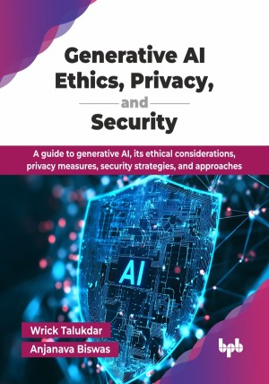

# Generative AI Ethics, Privacy, and Security

A guide to generative AI, its ethical considerations, privacy measures, security strategies, and approaches.

This is the repository for [Generative AI Ethics, Privacy, and Security
](https://bpbonline.com/products/generative-ai-ethics-privacy-and-security?_pos=1&_sid=6994638e1&_ss=r&variant=44749799096520?variant=44749799096520),published by BPB Publications.

## About the Book
Generative AI is transforming industries globally, with the majority of organizations using generative AI in at least one business function. From the fundamental evolution of transformer models to the complex ethical questions they raise, this book equips readers with the knowledge to navigate AI with confidence.

This book begins by introducing foundational concepts of generative AI and transformer model evolution, along with architectures, including GANs and autoencoders. It explores ethical frameworks and societal impacts, examines privacy challenges in data usage and generated content, and addresses security threats with mitigation strategies. Readers will learn responsible development and governance practices, navigate the legal and regulatory landscape, and learn how to educate users about AI capabilities and limitations. The book concludes with real-world case studies, best practices for deployment, and future directions for ethical innovation.

Upon completing this book, readers will possess the knowledge and skills to lead generative AI initiatives, balancing innovation with ethical responsibility. They will be able to make informed decisions about AI deployment, implement security and privacy measures, ensure regulatory compliance, and build AI systems that drive business value while maintaining public trust and societal benefit.

## What You Will Learn
• Explore transformer models, GANs, and autoencoder architectures.

• Implement ethical AI frameworks and bias mitigation strategies.

• Design privacy-preserving systems for sensitive data handling.

• Deploy security measures against adversarial attacks and misuse.

• Navigate global AI regulations and compliance requirements.

• Build responsible governance structures for AI deployment.

• Educate stakeholders on AI capabilities and limitations.

• Apply best practices through real-world case studies.
